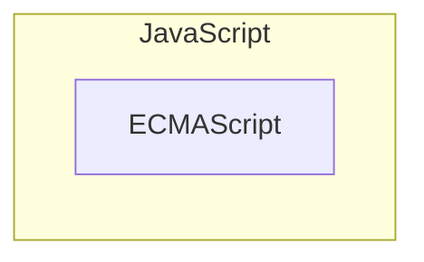

## 2. 자바스크립트란?

### 2.2 자바스크립트의 표준화

마이크로소프트에서 자바스크립트의 파생버전인 JScript를 내어 자사 브라우저만을 위한 기능을 경쟁적으로 추가 → 자바스크립트의 파편화 → **크로스 브라우징** 이슈 발생

표준화를 위해 ECMAScript 등장

| 버전 | 출시 연도 | 특징 |
| --- | --- | --- |
| ES1 | 1997 | 초판 |
| ES2 | 1998 | ISO/IEC 16262 국제 표준과 동일한 규격을 적용 |
| ES3 | 1999 | 정규 표현식, `try... catch` |
| ES5 | 2005 | HTML5와 함께 출현한 표준안
JSON, strict mode, 접근자 프로퍼티, 프로퍼티 어트리뷰트, 배열 메서드 |
| ES6 | 2015 | let/const, class, 화살표 함수, 템플릿 리터럴, 객체 분할 할당, 스프레드 문법, rest 파라미터, 심볼, 프로미스, Map/Set, 이터러블, `for...of` , 제너레이터, Proxy, 모듈 import/export |
| ES7 | 2016 | 지수 연산자, includes |
| ES8 | 2017 | async/await, Object 정적 메서드 |

### 2.4 자바스크립트와 ECMAScript

자바스크립트는 일반적으로 프로그래밍 언어로서 기본 뼈대를 이루는 ECMAScript와 브라우저가 별도 지원하는 클라이언트 사이드 Web API, 즉 DOM, BOM, Canvas, XMLHttpRequest, fetch, requestAnimationFrame, SVG, Web Storage, Web Component, Web Worker 등을 아우르는 개념이다.

### 2.5 자바스크립트의 특징

- 웹 브라우저에서 동작하는 유일한 프로그래밍 언어
- 인터프리터 언어
- 멀티 패러다임 프로그래밍 언어
- 프로토타입 기반의 객체지향 언어