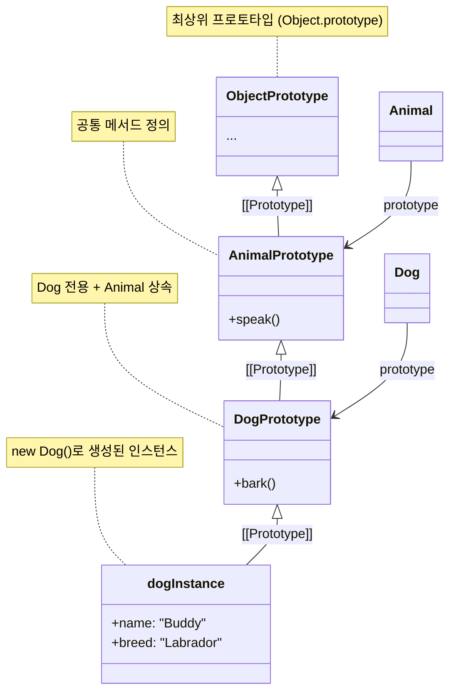
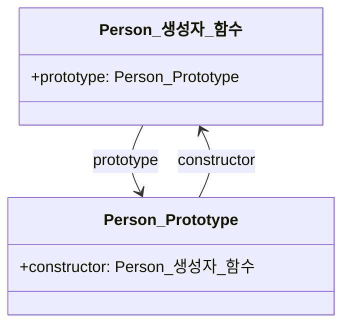

# 19. 프로토타입

- 자바스크립트는 명령형, 함수형, **프로토타입 기반 객체지향** 프로그래밍을 지원하는 멀티 패러다임 프로그래밍 언어다.
    - https://medium.com/@limsungmook/%EC%9E%90%EB%B0%94%EC%8A%A4%ED%81%AC%EB%A6%BD%ED%8A%B8%EB%8A%94-%EC%99%9C-%ED%94%84%EB%A1%9C%ED%86%A0%ED%83%80%EC%9E%85%EC%9D%84-%EC%84%A0%ED%83%9D%ED%96%88%EC%9D%84%EA%B9%8C-997f985adb42
- 자바스크립트를 이루고 있는 거의 모든 것이 객체다.

## 19.1. 객체지향 프로그래밍

- 절차지향적 프로그래밍에서 벗어나 **객체의 집합**으로 프로그램을 표현하는 패러다임
- 객체는 상태와 동작을 하나의 논리적 단위로 묶은 자료구조다.

## 19.2. 상속과 프로토타입

- **자바스크립트는 프로토타입 기반으로 상속을 구현한다.**



## 19.3. 프로토타입 객체

- 프로토타입은 어떤 객체의 상위(부모) 객체의 역할을 하는 객체로서 다른 객체에 공유 프로퍼티(메서드 포함)를 제공한다.
- 모든 객체는 하나의 프로토타입을 갖는다.
- 모든 프로토타입은 생성자 함수와 연결되어 있다.

### 19.3.1 __proto__ 접근자 프로퍼티

- 모든 객체는 __proto__ 접근자 프로퍼티를 통해 자신의 프로토타입에 간접적으로 접근할 수 있다.
- __prpto__는 접근자 프로퍼티다.
    - 자바스크립트는 원칙적으로 내부 슬롯과 내부 메서드에 직접 접근 및 호출을 허용하지 않는다.
    - __proto__ 접근자 프로퍼티를 통해 간접적으로 `[[Prototype]]` 내부 슬롯에 간접적으로 접근할 수 있다.
- __prpto__ 접근자 프로퍼티는 상속을 통해 사용된다.
    - 모든 객체는 상속을 통해 Object.prototype.__proto__ 접근자 프로퍼티를 사용할 수 있다.
- __proto__ 접근자 프로퍼티를 통해 프로토타입에 접근하는 이유
    - 프로토타입은 단방향 링크드 리스트로 구성되어야만 한다.
    - 프로토타입을 상호 참조하지 않게끔 하기 위함

### 19.3.2. 함수 객체의 prototype 프로퍼티

- 함수 객체만이 소유하는 prototype 프로퍼티는 생성자 함수가 생성할 인스턴스의 프로토타입을 가리킨다.
- 모든 객체가 가지고 있는 __proto__ 접근자 프로퍼티와 함수 객체의 prototype은 사실상 동일한 프로토타입을 가리킨다.

### 19.3.3. 프로토타입의 constructor 프로퍼티와 생성자 함수



- 모든 프로토타입은 constructor 프로퍼티를 갖는다.
- 이 constructor 프로퍼티는 prototype 프로퍼티로 자신을 참조하고 있는 생성자 함수를 가리킨다.

## 19.4. 리터럴 표기법에 의해 생성된 객체의 생성자 함수와 프로토타입

- 리터럴 표기법에 의해 생성된 객체는 생성자 함수를 통해 생성되지 않았음에도 가상적인 생성자 함수를 가진다.
    - 상속을 위해 프로토타입이 필요하고, 프로토타입은 생성자 함수와 더불어 생성되기때문이다.
    - 프로토타입과 생성자 함수는 단독으로 존재할 수 없고 언제나 쌍으로 존재한다.

## 19.5. 프로토타입의 생성 시점

- 프로토타입은 생성자 함수가 생성되는 시점에 더불어 생성된다.

### 19.5.1. 사용자 정의 생성자 함수와 프로토타입 생성 시점

- 함수 정의가 평가되어 함수 객체를 생성하는 시점에 프로토타입도 더불어 생성된다.

### 19.5.2. 빌트인 생성자 함수와 프로토타입 생성 시점

- 모든 빌트인 생성자 함수는 전역 객체가 생성되는 시점에 생성된다.

> [!NOTE]
> 전역 객체
> 코드가 실행되기 전에 자바스크립트 엔진에 의해 생성되는 객체
> 클라이언트 환경에서는 window, 서버 사이드 환경에서는 global

## 19.7. 프로토타입 체인

- 자바스크립트는 객체의 프로퍼티에 접근하려고 할 때 해당 객체에 프로퍼티가 없다면 프로토타입의 프로퍼티를 순차적으로 검색한다.
- 프로토타입의 최상위에 위치하는 객체는 언제나 **Object.prototype**이다.
- **프로토타입 체인**은 **상속과 프로퍼티 검색**을 위한 메커니즘이다.
- **스코프 체인**은 **식별자 검색**을 위한 메커니즘이다.

## 19.8. 오버라이딩과 프로퍼티 섀도잉

- 프로토타입에 정의된 프로퍼티를 인스턴스에 추가하면 오버라이딩된다.
- 상속 관계에 의해 프로퍼티가 가려지는 현상을 프로퍼티 섀도잉이라고 한다.
- 하위 객체에서 상위 객체 (프로토타입)의 프로퍼티를 수정할 수는 없다.

## 19.9. 프로토타입의 교체

- 프로토타입은 다른 객체로 변경될 수 있다.
    - 이를 통해 객체간의 상속 관계를 동적으로 변경할 수 있다.
- 생성자 함수와 Object.setPrototypeOf 메서드를 통해 교체할 수 있지만, 생성자 함수와 prototype의 연결을 직접 처리하는 과정이 번거롭기 때문에 직접 교체는 지양하는 편이 좋다.

## 19.10. instanceof 연산자

```jsx
객체 instanceof 생성자 함수
```

- 생성자 함수의 prototype에 바인딩된 객체가 좌변 객체의 프로토타입 체인 상에 존재하는지 검사

## 19.11. 직접 상속

- Object.create
- 객체 리터럴을 통한 생성시 __proto__ 에 의한 직접 상속
    
    ```jsx
    const obj = {
    	x: 5,
    	__proto__: myProto
    }
    ```
    

## 19.12. 정적 프로퍼티/메서드

- 인스턴스를 생성하지 않아도 사용할 수 있는 프로퍼티/메서드 (static)

## 19.13. 프로퍼티 존재 확인

- in 연산자
- Object.prototype.hasOwnProperty

## 19.14. 프로퍼티 열거

### 19.14.1. for … in 문

- 객체의 **프로토타입 체인 상에 존재하는 모든 프로토타입**의 프로퍼티 중에서 열거 가능한 프로퍼티를 열거한다.

### 19.14.2. Object.keys/values/entries

- 객체의 고유 프로퍼티만 열거한다.
