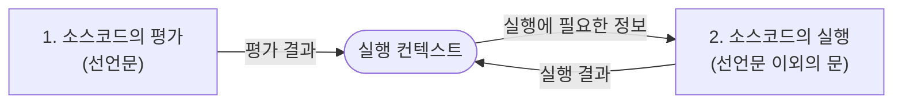
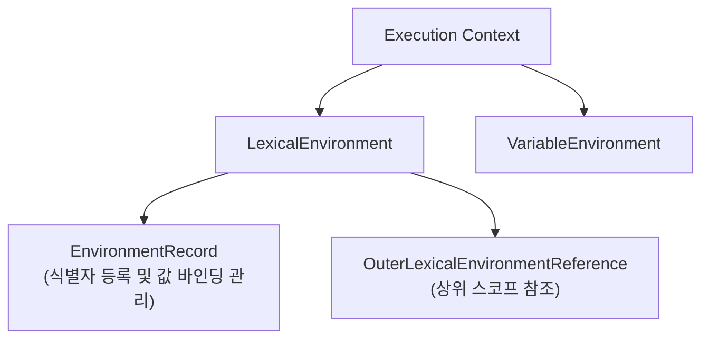
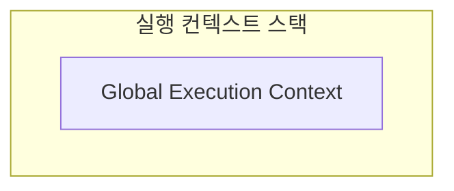
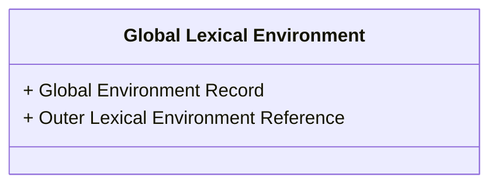
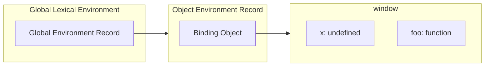
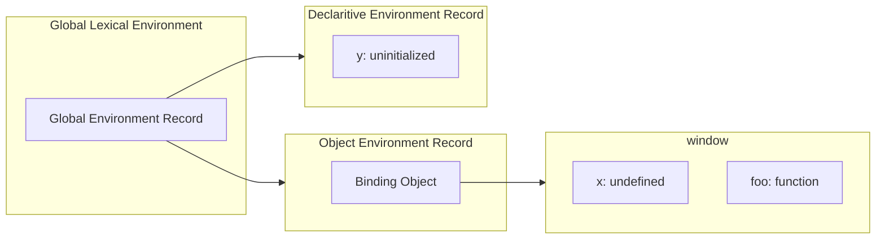
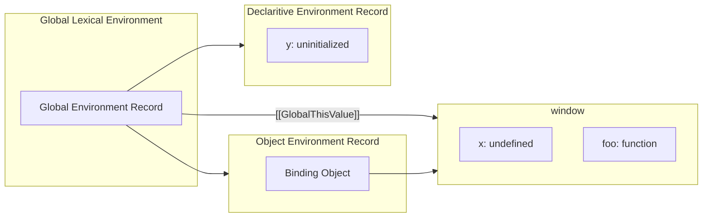
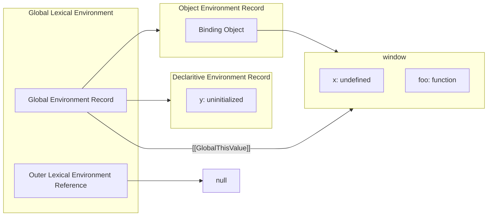

# 23. 실행 컨텍스트

## 23.1. 소스코드의 타입

- ECMAScript 사양은 소스코드를 4가지 타입으로 구분한다.

| 소스코드의 타입 | 설명 | 스코프 관리 내용 |
| --- | --- | --- |
| 전역 코드 | 전역에 존재하는 소스코드. 전역에 정의된 함수, 클래스 등의 내부 코드는 포함하지 않는다. | 전역 스코프 생성해 전역 변수, 전역 함수 관리. |
| 함수 코드 | 함수 내부 소스코드. 함수 내부에 중첩된 함수, 클래스 등의 내부 코드는 포함하지 않는다. | 지역 스코프 생성해 지역 변수, 매개변수, arguments 객체 관리.  |
| eval 코드 | eval 함수에 인수로 전달되어 실행되는 소스 코드. | strict mode에서 자신만의 독자적 스코프 생성. |
| 모듈 코드 | 모듈 내부에 존재하는 소스 코드. 모듈 내부에 정의된 함수, 클래스 등의 내부 코드는 포함하지 않는다. | 모듈별로 독립적인 모듈 스코프 생성. |

## 23.2. 소스코드의 평가와 실행

- 자바스크립트는 소스코드를 '소스코드의 평가'와 '소스코드의 실행' 과정으로 나누어 처리한다.



## 23.3. 실행 컨텍스트의 역할

- 실행 컨텍스트는 식별자를 틍록하고 관리하는 스코프와 코드 실행 순서 관리를 구현한 내부 메커니즘으로, 모든 코드는 실행 컨텍스트를 통해 실행되고 관리된다.
- 식별자와 스코프는 실행 컨텍스트의 렉시컬 환경으로 관리되고 코드 실행 순서는 실행 컨텍스트 스택으로 관리된다.

## 23.4. 실행 컨텍스트 스택

- 실행 컨텍스트는 스택 자료구조로 관리된다.

## 23.5. 렉시컬 환경

- 렉시컬 환경은 식별자와 식별자에 바인딩된 값, 그리고 상위 스코프에 대한 참조를 기록하는 자료구조로 실행 컨텍스트를 구성하는 컴포넌트다.
- 실행 컨텍스트 스택이 코드의 실행 순서를 관리한다면 렉시컬 환경은 스코프와 식별자를 관리한다.
- 실행 컨텍스트는 LexicalEnvironment 컴포넌트와 VariableEnvironment 컴포넌트로 구성된다.
- 렉시컬 환경은 EnvironmentRecord와 OuterLexicalEnvironmentReference로 구성된다
    - 환경 레코드(EnvironmentRecord): 스코프에 포함된 식별자를 등록하고 등록된 식별자에 바인딩된 값을 관리하는 저장소
    - 외부 렉시컬 환경에 대한 참조(OuterLexicalEnvironmentReference): 외부 렉시컬 환경에 대한 참조는 상위 스코프를 가리킨다.



## 23.6. 실행 컨텍스트의 생성과 식별자 검색 과정

```jsx
var x = 1;
const y = 2;

function foo (a) {
	var x = 3;
	const y = 4;
	function var (b) {
		const z = 5;
	 	console.log(a + b + x + y + z);
	}
	bar(10);
}
foo(20); // 42
```

### 23.6.1. 전역 객체 생성

- 전역 객체는 전역 코드가 평가되기 이전에 생성된다.
- 전역 객체도 프로토타입 체인의 일원이다.

### 23.6.2. 전역 코드 평가

1. 전역 실행 컨텍스트 생성
2. 전역 렉시컬 환경 생성
    1. 전역 환경 레코드 생성
        1. 객체 환경 레코드 생성
        2. 선언적 환경 레코드 생성
    2. this 바인딩
    3. 외부 렉시컬 환경에 대한 참조 결정

1. 전역 실행 컨텍스트 생성

- 비어있는 전역 실행 컨텍스트를 생성하여 실행 컨텍스트 스택에 푸시한다.



1. 전역 렉시컬 환경 생성
    - 전역 렉시컬 환경을 생성하고 전역 실행 컨텍스트에 바인딩한다.
    
    ```mermaid
    flowchart TD
      subgraph REC["실행 컨텍스트 스택"]
    	  subgraph GEC["Global Execution Context"]
    	    LE["LexicalEnvironment"]
    	  end
    	 end
    
      GLE["Global Lexical Environment"]
    
      LE --> GLE
    ```
    

2.1. 전역 환경 레코드 생성

- 전역 환경 레코드는 전역 스코프 역할을 하는 전역 렉시컬 환경을 구성하는 컴포넌트다.
- 전역 환경 레코드는 객체 환경 레코드와 선언적 환경 레코드로 구성되어 있다.



2.1.1. 객체 환경 레코드 생성

- 객체 환경 레코드는 BindingObject라고 부르는 전역 객체와 연결된다.
- 전역 코드 평가 과정에서 전역 변수와 전역 함수는 BindingObject를 통해 전역 객체의 프로퍼티와 메서드가 된다.



2.1.2. 선언적 환경 레코드 생성

- 전역 변수와 전역 함수 이외의 선언은 선언적 환경 레코드에 등록되고 관리된다.
- 선언 단계와 초기화 단계가 분리되어 진행되어, 런타임에 실행 흐름이 변수 선언문에 도달하기 전에는 일시적 사각지대 (TDZ)에 빠지게 된다.



2.2. this 바인딩

- 전역 환경 레코드의 [[GlobalThisValue]] 내부 슬롯에 this가 바인딩된다.



2.3. 외부 렉시컬 환경에 대한 참조 결정

- 외부 렉시컬 환경에 대한 참조는 현재 평가중인 스코프의 상위 스코프를 가리킨다.



### 23.6.3. 전역 코드 실행

- 변수나 함수를 참조하기 위해 어느 스코프의 식별자를 참조하면 되는지 결정해야 한다.
    - 이를 식별자 결정이라 한다.
- 식별자 결정을 할 때는 현재 실행중인 실행 컨텍스트부터 상위 컨텍스트로 이동하며 검색한다.

### 23.6.4. foo 함수 코드 평가

1. 함수 실행 컨텍스트 생성
2. 함수 렉시컬 환경 생성
    1. 함수 환경 레코드 생성
    2. this 바인딩
    3. 외부 렉시컬 환경에 대한 참조 결정
- 자바스크립트는 함수를 어디서 호출했는지가 아니라 어디서 정의했는지에 따라 상위 스코프를 결정한다.

### 23.6.5. foo 함수 코드 실행

### 23.6.6. bar 함수 코드 평가

### 23.6.7. bar 함수 코드 실행

### 23.6.8. bar 함수 코드 실행 종료

### 23.6.9. foo 함수 코드 실행 종료

### 23.6.10. 전역 코드 실행 종료

## 23.7. 실행 컨텍스트와 블록 레벨 스코프

- var 키워드 변수는 오로지 함수 레벨 스코프만을 따른다.
- let, const 키워드 변수는 블록 레벨 스코프를 따른다.
